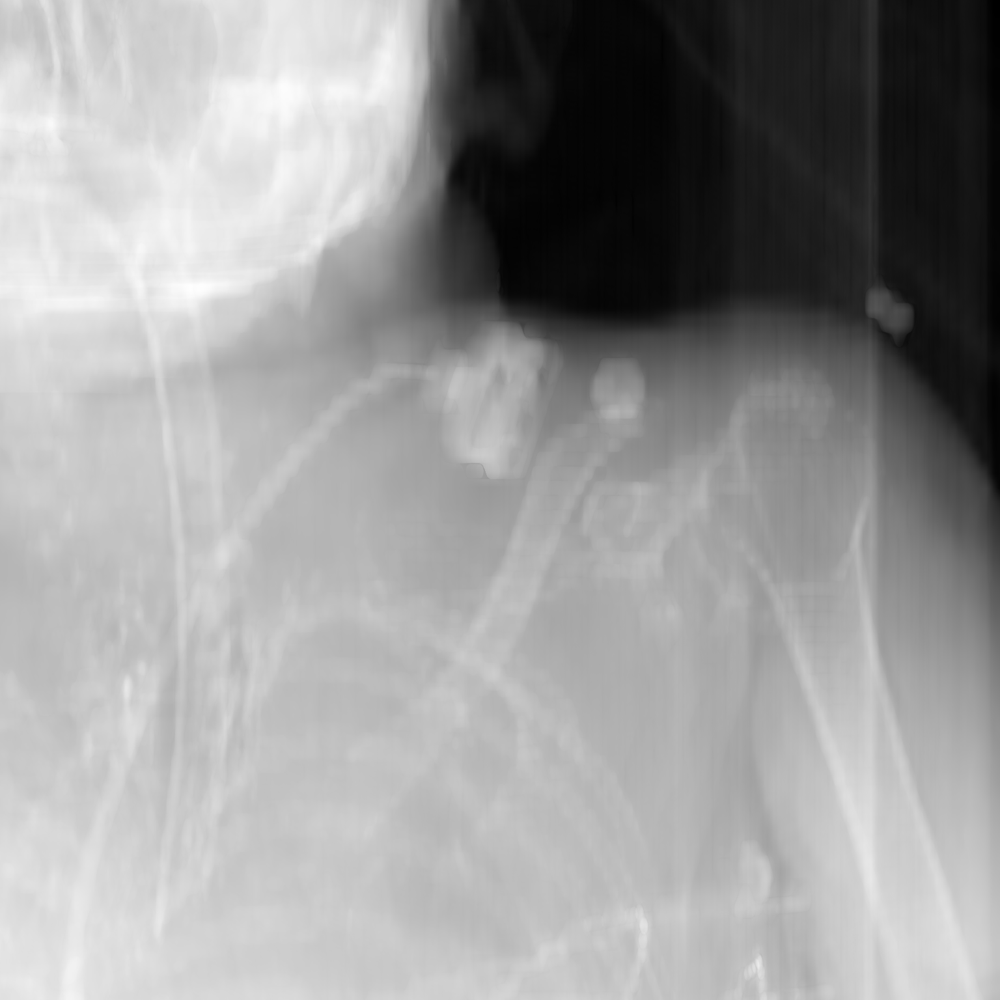
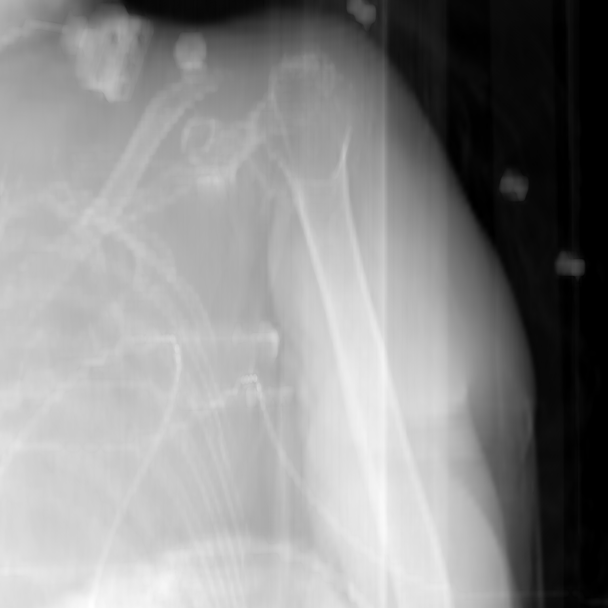
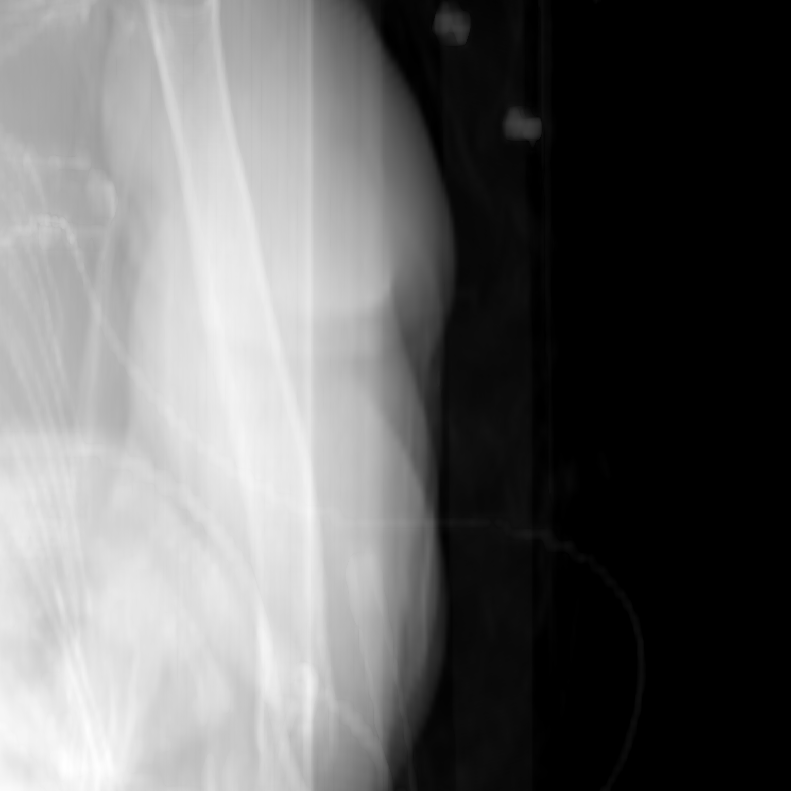

# Navigation Results Comparison

This document provides a side-by-side comparison of the navigation results.

## Comparison Table

| Init Image | Base Model (Path 1) | Base Model (Path 2) | Base Model (Path 3) |
|:----------:|:-------------------:|:-------------------:|:-------------------:|
|  |  |  |  |

> [!NOTE]
> Ensure the images exist in `results/navigation/` for them to display correctly.
