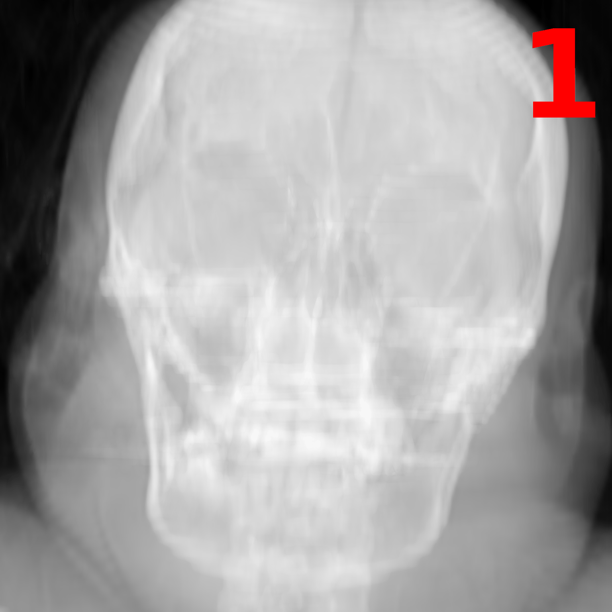
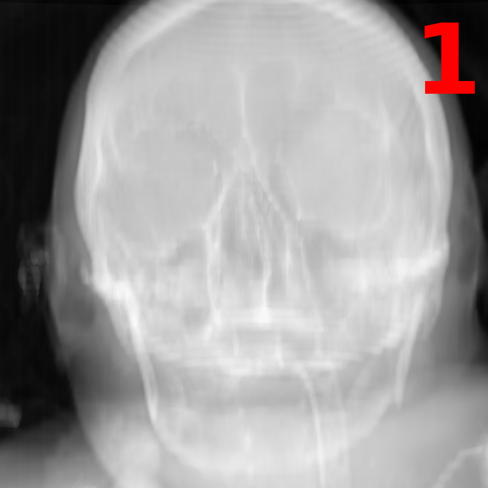
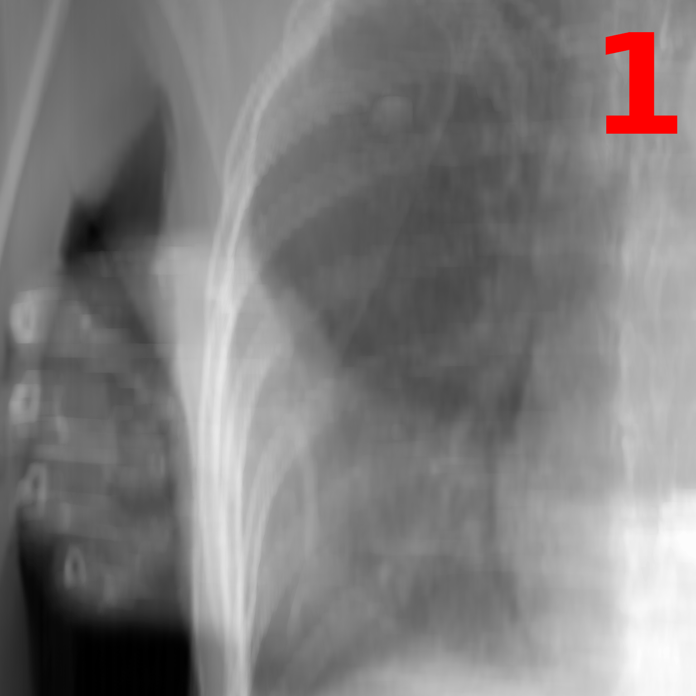
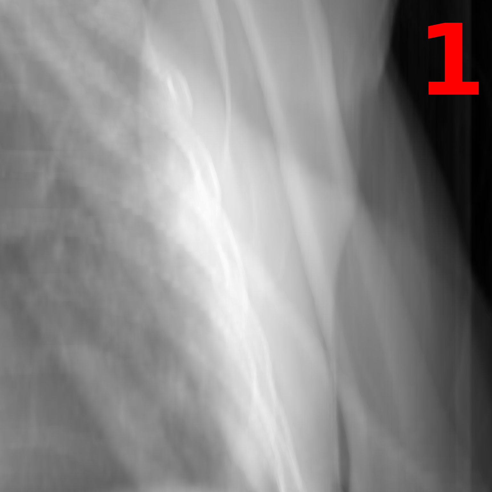

# Navigation Results Comparison

This document provides a side-by-side comparison of the navigation results using animated GIFs.
The red number in the top-right corner indicates the step in the sequence (init -> path1 -> path2 -> path3).

## Comparison Table

| Path Identifier | Base Model | Finetuned Model |
|:---:|:---:|:---:|
| **1_4** |  |  |
| **1_5** |  |  |
| **4_1** |  |  |
| **5_1** |  |  |

> [!NOTE]
> The GIFs visualize the progression from the initial image through the predicted paths.
